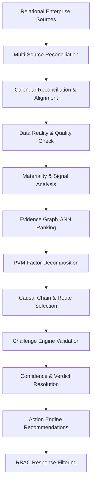

# EvidenceGraph AI

> Accenture Anomaly Investigation Engine for E-Commerce Order Fulfillment
> Track 3: BusinessIntelligence.ai — Accenture Innovation Challenge 2026

EvidenceGraph AI is an autonomous investigation engine that detects, investigates, and recommends operational interventions for revenue anomalies in e-commerce fulfillment operations. It combines GNN-based graph causality analysis with dynamic LLM narration, RAG, and an interactive counterfactual intervention sandbox to provide domain-contextualized decision support.

---

## 📖 Table of Contents
1. [Tech Stack](#-tech-stack)
2. [Causal & Pipeline Architecture](#-causal--pipeline-architecture)
3. [How to Run the Repo](#-how-to-run-the-repo)
4. [Detailed Business Solution](#-detailed-business-solution)
5. [Why the Intervention Sandbox is Guarded for Region E](#-why-the-intervention-sandbox-is-guarded-for-region-e)
6. [Future System Enhancements](#-future-system-enhancements)
7. [GitHub Repository Push Guide](#-github-repository-push-guide)

---

## 🛠 Tech Stack

EvidenceGraph AI is built using a modern decoupled full-stack architecture:

### Backend Architecture
* **FastAPI (Python 3.10+)**: High-performance web framework for the core API endpoints.
* **pandas & NumPy**: Data loading, cleansing, rolling-window alignment, and mathematical calculations.
* **statsmodels**: Linear regression, confidence interval calculations, and statistical significance analysis.
* **NetworkX**: In-memory representation of the Evidence Graph topology, node paths, and causality flows.
* **google-genai SDK**: Modern SDK used to call Google Gemini 2.5 Flash (`gemini-2.5-flash`) for natural language narration and interactive Q&A.
* **groq SDK & SQLite**: Dual fallback engines for LLM narration (Llama3) and storage layers (RAG vector matching emulation).

### Frontend Architecture
* **React 18 & Next.js 14 (App Router)**: Framework for server-rendered page shells and interactive client components.
* **TypeScript**: Type safety across state representations, persona mappings, and API structures.
* **Vanilla CSS**: Premium bespoke UI styling incorporating Accenture branding purple (`#a100ff`), glassmorphism, responsive flex layouts, and custom loading states.
* **SVG Graph Rendering**: Dynamic, custom-built graph visualization displaying node rings, custom edge line indicators, and path highlighting.

---

## ⚙️ Causal & Pipeline Architecture

The backend pipeline executes sequentially when an investigation is run. Below is the detailed architecture of the 11 sequential processing stages:



### Detailed Pipeline Components

#### 1. Multi-Source Reconciliation (`reconciliation.py`)
* **Purpose**: Ingests raw transactional logs from five decoupled enterprise silos (OMS, WMS, Logistics, Support, Marketing).
* **Process**: Joins datasets on shared transaction keys, matching order timestamps to customer ticket logs and shipping barcodes to establish a single source of truth (Reconciled Data Frame).

#### 2. Calendar Reconciliation & Alignment (`calendar_reconciliation.py`)
* **Purpose**: Standardizes timestamps across varying operational clocks (WMS local warehouse time vs. OMS global API transaction time).
* **Process**: Computes offsets, removes timezone skew, and aligns rolling daily or hourly windows to ensure causal correlations are calculated on synchronized timelines.

#### 3. Data Reality & Quality Check (`data_reality_check.py`)
* **Purpose**: Evaluates data freshness and schema integrity.
* **Process**: Compares maximum transaction dates against reference dates to compute fresh lags. Marks files as `FRESH` or `STALE`. If checks fail, the engine enters an `ABSTAIN` state to prevent feeding corrupted data downstream.

#### 4. Materiality & Signal Analysis (`materiality.py`)
* **Purpose**: Determines if there is a statistically significant anomaly worth investigating.
* **Process**: Compares current KPI deviations (e.g. revenue drops or cancellation spikes) against historical standard deviations ($\sigma$). If the deviation exceeds the materiality threshold, the investigation proceeds.

#### 5. Evidence Graph GNN Ranking (`evidence_graph.py`)
* **Purpose**: Represents KPIs as nodes in a graph with causal relationships as edges.
* **Process**: Constructs a network topology where edges are weighted by rolling correlation coefficients. A GNN model ranks the nodes, placing the highest central nodes at the top of the potential root cause list.

#### 6. PVM Factor Decomposition (`pvm_decomposition.py`)
* **Purpose**: Isolates commercial and seasonal impacts from operational errors.
* **Process**: Decomposes revenue changes into three factors:
  $$\Delta \text{Revenue} = \text{Price Component} + \text{Volume Component} + \text{Marketing Component} + \text{Seasonal Component}$$
  This prevents the system from blaming warehouse staffing for a revenue drop that is actually driven by a seasonal index decline or a marketing budget cut.

#### 7. Causal Chain & Route Selection (`root_cause.py`)
* **Purpose**: Reconstructs the propagation path of the anomaly.
* **Process**: Finds the shortest dependency path from the primary driver to the revenue node (e.g., `warehouse_staffing_level` $\rightarrow$ `fulfillment_delay_rate` $\rightarrow$ `order_cancellation_rate` $\rightarrow$ `revenue`).

#### 8. Challenge Engine Validation (`challenge_engine.py`)
* **Purpose**: Audits the findings for contradictory patterns.
* **Process**: Cross-references indicators. For example, if fulfillment delays are high but customer support tickets report zero delivery complaints, the challenge engine flags a contradiction, lowering the confidence score and pushing the verdict to `INVESTIGATE`.

#### 9. Confidence & Verdict Resolution (`confidence.py`)
* **Purpose**: Recommends whether the enterprise should act immediately or run more audits.
* **Process**: Calculates a composite confidence score ($C \in [0.0, 1.0]$) using weights on Data Quality, Signal Strength, Cross-Source Consistency, Evidence Depth, and Causal Chain Completeness.
  * $C \ge \text{ACT\_THRESHOLD}$ ($0.68$) $\rightarrow$ **`ACT`**
  * $C < \text{ACT\_THRESHOLD}$ but significant signal $\rightarrow$ **`INVESTIGATE`**
  * Failure of data quality check $\rightarrow$ **`ABSTAIN`**

#### 10. Action Engine Recommendations (`action_engine.py`)
* **Purpose**: Prescribes remediation actions.
* **Process**: Maps the resolved primary driver to specific playbook actions (e.g. "Trigger backup logistics carrier" or "Deploy warehouse shift incentives") and assigns an operational owner (e.g. Operations Director or Marketing VP).

#### 11. RBAC Response Filtering (`rbac.py`)
* **Purpose**: Filters the final payload based on the user's role before it leaves the server.
* **Process**: Hides financial fields (like USD impacts or PVM charts) from the `ops_lead` persona while exposing full analytical details to the `analyst` and high-level summaries to the `gm`.

---


---

## 🚀 How to Run the Repo

### 1. Backend Engine Setup
Navigate to the `engine` directory:
```bash
cd engine
```

Create a Python virtual environment and activate it:
```bash
python -m venv venv
# On Windows:
venv\Scripts\activate
# On macOS/Linux:
source venv/bin/activate
```

Install dependencies:
```bash
pip install -r requirements.txt
```

Generate the synthetic source database CSV files:
```bash
python data/generate_synthetic.py
```

Configure your environment variables in `.env` (create this file inside `engine/`):
```env
GOOGLE_API_KEY=your_gemini_api_key_here
```

Start the FastAPI application server:
```bash
python -m uvicorn main:app --reload --port 8000
```
The API documentation will be available at `http://localhost:8000/docs`.

---

### 2. Frontend Dashboard Setup
Navigate to the `frontend` directory:
```bash
cd ../frontend
```

Install packages:
```bash
npm install
```

Configure your environment variable in `.env.local` (already preset for localhost):
```env
NEXT_PUBLIC_ENGINE_URL=http://localhost:8000
```

Start the Next.js development server:
```bash
npm run dev
```
Open `http://localhost:3000` in your web browser.

---

### 3. Running the Verification Tests
To run the automated evaluation suite verifying all 5 regions:
```bash
cd ../engine
python evaluate.py
```

---

## 💼 Detailed Business Solution

E-commerce fulfillment networks are highly complex, interdependent systems. A failure in one node (e.g., warehouse staffing) propagates downstream (causing pick delays, transit delays, order cancellations) and eventually impacts top-line revenue. Traditional monitoring dashboards only show **what** happened, leaving analysts to guess **why** it happened.

EvidenceGraph AI solves this by introducing three core innovations:

1. **Deterministic Multi-Source Reconciliation & Causal Graphs**:
   It ingests raw, un-aggregated logs (OMS, WMS, Logistics, Support, Marketing), checks for data freshness, resolves calendar anomalies, and projects them onto an **Evidence Graph**. The system ranks root causes based on statistical materiality and causal topology rather than simple correlation.
2. **Context-Aware Decision Recommendation (ACT vs. INVESTIGATE vs. ABSTAIN)**:
   Instead of triggering alerts blindly, the engine evaluates the confidence and contradictions in the evidence:
   * **ACT**: Highly consistent evidence; triggers immediately with a structured remediation card.
   * **INVESTIGATE**: Contradictory evidence (e.g., Region B where logs show high delays but customer support reports zero complaints); triggers structured investigations.
   * **ABSTAIN**: Data quality checks fail or historical sparse records make it statistically unsafe to conclude; pauses and flags the data source.
3. **Role-Based Access Control (RBAC)**:
   Insights are filtered based on the active user persona:
   * **General Managers (GM)** see financial impact, revenue recovery projections, and overall PVM decomposition.
   * **Operations Leads** are shielded from sensitive financial/revenue variables and focus entirely on operational metrics (fulfillment delays, staffing levels, cancellations).
   * **Data Analysts** get access to raw sub-scores, graph weights, and correlation matrices.

---

## ⚠️ Why the Intervention Sandbox is Guarded for Region E

When viewing **Region E** on the dashboard, you will notice that the **Intervention Sandbox is replaced with an informational banner**:
> *"Price-Volume-Marketing (PVM) scenario active. Operational levers do not apply here."*

### The Reason:
* **Region E** corresponds to the **`multi_factor_pvm`** scenario.
* In this scenario, the revenue anomaly is caused by **unit price shifts, marketing spend shocks, and seasonal factors** (external commercial drivers), rather than internal operational disruptions (like warehouse staffing shortages or logistics delays).
* The sandbox is designed to simulate operational interventions (e.g., "What happens if we hire 5 more warehouse workers?"). In a PVM scenario, changing warehouse staffing will have **zero mathematical impact** on recovering a revenue drop caused by a price change or a seasonal slump.
* Rerunning simulations in this scenario would output invalid counterfactual predictions. The guard check prevents business users from making decisions based on inappropriate levers.

---

## 📈 Future System Enhancements

To scale EvidenceGraph AI into a production-grade enterprise application, we propose the following improvements:

### 1. Causal Machine Learning (Double ML / DoWhy)
Replace the current heuristic regression/causal chain models with rigorous Causal Machine Learning frameworks like Microsoft's **DoWhy** or **EconML**. This allows for double machine learning estimators to isolate true treatment effects of operational interventions, removing confounding factors.

### 2. Multi-Agent Graph Collaborators
Transform the chatbot from a single-turn Q&A helper into an agentic system:
* **Data Agent**: Runs ad-hoc SQL queries against the underlying database if asked questions outside the pre-computed summary.
* **Causal Agent**: Simulates complex multi-lever scenarios (e.g., "What if we increase staffing AND change transit carrier?").
* **Verifier Agent**: Automatically checks for logic gaps or contradictions in user suggestions.

### 3. Dynamic RAG Vector Search with Milvus/Pinecone
Currently, RAG evidence is emulated using SQLite BM25 keyword matching. A true production system should store PDF operational guidelines, carrier SLA contracts, and historical incident logs as embeddings in a vector database like **Milvus** or **Pinecone** to run semantically rich context-retrieval.

### 4. Real-Time Streaming Ingestion
Integrate **Apache Kafka** or **Google Cloud Pub/Sub** to stream logs directly into a real-time analytics layer (e.g., Flink), running the reconciliation and materiality pipeline continuously instead of in batches.

---

## 💻 GitHub Repository Push Guide

Since the repository does not exist on your GitHub account yet, follow these simple steps to initialize and push:

1. **Go to GitHub**: Log in to [https://github.com](https://github.com).
2. **Create a New Repository**:
   * Click **New** (or go to [https://github.com/new](https://github.com/new)).
   * Owner: **`PoonamGupta078`**
   * Repository Name: **`segmentation_error`**
   * Description: *EvidenceGraph Anomaly Investigation Engine*
   * Visibility: Select **Private** (as requested).
   * **Do NOT check** "Add a README", "Add .gitignore", or "Choose a license" (we already have these locally).
   * Click **Create repository**.
3. **Push from your Terminal**:
   Run the following commands inside `C:\Users\HP\.gemini\antigravity-ide\scratch\segmentation_error`:
   ```bash
   # Verify remote URL is correct:
   git remote set-url origin https://github.com/PoonamGupta078/segmentation_error.git

   # Push to the main branch on GitHub:
   git push -u origin main
   ```
4. **Enter Credentials**:
   * Git will prompt you for your GitHub credentials.
   * **IMPORTANT**: When prompted for your password, use your **GitHub Personal Access Token (PAT)** rather than your account password, as GitHub no longer accepts account passwords for command-line authentication.
