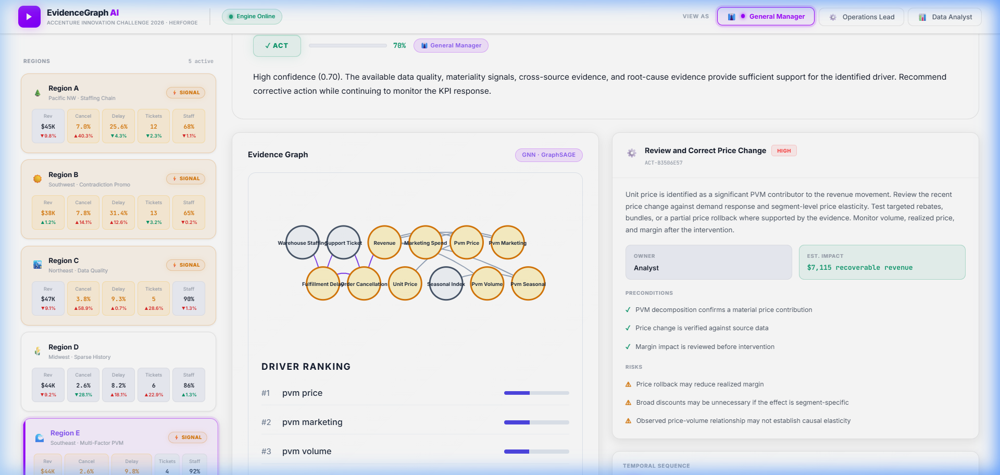
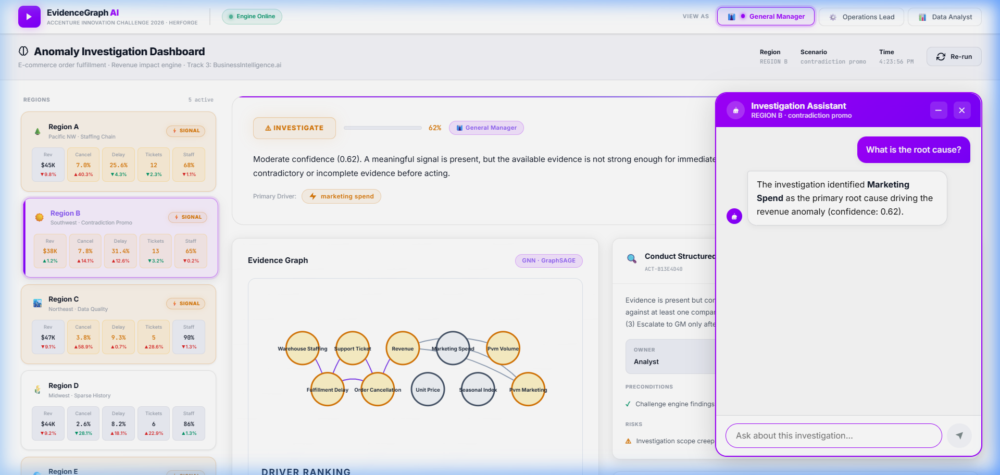

# EvidenceGraph AI

### KPI Intelligence-to-Action Engine
### Team HerForge
### Accenture Innovation Challenge 2026 · Round 2 · Track 3: BusinessIntelligence.ai

---

EvidenceGraph AI is a full-stack anomaly investigation and decision-intelligence prototype for e-commerce operations.

Instead of stopping at detecting that a KPI changed, the system investigates whether the movement is real, traces possible drivers through a typed evidence graph, evaluates temporal and statistical evidence, challenges competing explanations, performs financial attribution where applicable, and determines whether the available evidence supports:

- ACT
- INVESTIGATE
- ABSTAIN

The system follows one core principle:

> **The LLM does not compute the truth. It explains evidence computed and approved by the investigation engine.**

Quantitative outputs — including anomaly signals, root-cause rankings, confidence scores, PVM contributions, and verdicts — are produced by deterministic backend logic. The LLM is used only for grounded, persona-aware explanation and conversational follow-up.

---

## Frontend
**Region E — Multi-Factor PVM (Verdict: ACT, Confidence: 70%)**



Region E (Southeast, Multi-Factor PVM scenario). Operational KPIs are healthy. PVM decomposition identifies unit price as the primary commercial driver through zero-variance step-change detection. Verdict: ACT with 70% confidence.

**Investigation Assistant (Region B — Chatbot)**



The Investigation Assistant answers user questions grounded in backend-computed investigation context. The LLM does not compute numbers — it explains results returned by the analytical engine.

---

## 1. Overview

Traditional dashboards answer:

> "What changed?"

EvidenceGraph AI answers:

> "Why did it change?"
> "What evidence supports that explanation?"
> "Could something else be causing it?"
> "How confident are we?"
> "Should we ACT, INVESTIGATE, or ABSTAIN?"
> "What could happen if we intervene?"

---

## 2. The Core Idea

```text
DETECT
   |
VERIFY DATA
   |
IDENTIFY MATERIAL SIGNAL
   |
BUILD EVIDENCE GRAPH
   |
RANK ROOT CAUSES
   |
CHALLENGE THE HYPOTHESIS
   |
CALCULATE CONFIDENCE
   |
ACT / INVESTIGATE / ABSTAIN
   |
SIMULATE INTERVENTION
   |
RECOMMEND ACTION
   |
EXPLAIN THROUGH LLM
```

---

## 3. Why This Is Different From a Traditional Dashboard

A conventional dashboard shows:

```text
Revenue -12%
Cancellation Rate +8%
Fulfillment Delay +15%
```

The business user still has to determine what happened manually.

EvidenceGraph AI transforms this into:

```text
Revenue anomaly detected
        |
Data quality verified
        |
Fulfillment problem confirmed
        |
Warehouse staffing changed first
        |
Delay increased afterwards
        |
Cancellations increased
        |
Revenue declined
        |
Alternative explanations challenged
        |
Confidence calculated
        |
Recommended decision
```

---

## 4. System Architecture

```text
                    +---------------------------------+
                    |  Enterprise Data Sources        |
                    |  OMS · Logistics · WMS          |
                    |  Support · Marketing            |
                    +---------------+-----------------+
                                    |
                                    v
                    +---------------------------------+
                    |  Data Reality & Reconciliation  |
                    |  Alignment · Completeness       |
                    |  Missing data · History         |
                    +---------------+-----------------+
                                    |
                                    v
                    +---------------------------------+
                    |  Materiality Engine             |
                    |  Statistical + Business         |
                    |  Impact Detection               |
                    +---------------+-----------------+
                                    |
                                    v
                    +---------------------------------+
                    |  Evidence Graph                 |
                    |  Typed KPI relationships        |
                    |  Temporal sequencing            |
                    |  Statistical edge weights       |
                    +---------------+-----------------+
                                    |
                                    v
                    +---------------------------------+
                    |  Root Cause Engine              |
                    |  Temporal sequencing            |
                    |  Effect sizes                   |
                    |  Driver ranking                 |
                    |  PVM attribution                |
                    +---------------+-----------------+
                                    |
                                    v
                    +---------------------------------+
                    |  Challenge Engine               |
                    |  Contradictions                 |
                    |  Cross-region comparison        |
                    |  Alternative explanations       |
                    +---------------+-----------------+
                                    |
                                    v
                    +---------------------------------+
                    |  Confidence Gate                |
                    |  ACT / INVESTIGATE / ABSTAIN    |
                    +---------------+-----------------+
                                    |
              +---------------------+---------------------+
              v                                           v
   +---------------------+                   +---------------------+
   |  Intervention        |                   |  Action Engine      |
   |  Sandbox             |                   |  Driver -> Action   |
   |  Counterfactuals     |                   |  Owner -> Risk      |
   +----------+----------+                   +----------+----------+
              |                                          |
              +--------------------+---------------------+
                                   v
                    +---------------------------------+
                    |  RBAC / Persona Layer           |
                    |  GM · Ops Lead · Analyst        |
                    +---------------+-----------------+
                                    |
                                    v
                    +---------------------------------+
                    |  RAG + LLM Narrator             |
                    |  Evidence retrieval             |
                    |  Natural-language explanation   |
                    +---------------+-----------------+
                                    |
                                    v
                    +---------------------------------+
                    |  Decision Workspace             |
                    |  Dashboard · Graph · Actions   |
                    |  Sandbox · PVM · Chatbot        |
                    +---------------------------------+
```

---

## 5. Repository Structure

```text
segmentation_error/
|
+-- engine/
|   +-- main.py                  FastAPI application
|   +-- evaluate.py              Pipeline evaluation harness
|   |
|   +-- data/
|   |   +-- generate_synthetic.py
|   |
|   +-- pipeline/
|   |   +-- reconciliation.py
|   |   +-- data_reality_check.py
|   |   +-- calendar_reconciliation.py
|   |   +-- materiality.py
|   |   +-- evidence_graph.py
|   |   +-- root_cause.py
|   |   +-- pvm_decomposition.py
|   |   +-- challenge_engine.py
|   |   +-- confidence.py
|   |   +-- intervention_sandbox.py
|   |   +-- action_engine.py
|   |   +-- rbac.py
|   |
|   +-- rag/
|   |   +-- retriever.py
|   |
|   +-- llm/
|   |   +-- narrator.py
|   |   +-- chatbot.py
|   |
|   +-- feedback/
|   |   +-- store.py
|   |
|   +-- telemetry/
|       +-- tracker.py
|
+-- frontend/
|   +-- src/
|   |   +-- app/
|   |   +-- components/
|   |   +-- lib/
|   |       +-- api.ts
|   |
|   +-- package.json
|
+-- README.md
```

---

## 6. Backend Components

### 6.1 Multi-Source Reconciliation (`pipeline/reconciliation.py`)

Enterprise data arrives from five source systems with different schemas, granularities, timestamps, and entity identifiers.

The reconciliation layer aligns all sources into a common analytical dataframe.

| Source | Example KPIs |
|---|---|
| OMS | Revenue, cancellations |
| Logistics | Fulfillment delays |
| WMS | Warehouse staffing |
| Support | Customer ticket volume |
| Marketing | Marketing spend |

### 6.2 Calendar Reconciliation (`pipeline/calendar_reconciliation.py`)

Checks whether observed KPI movements coincide with known calendar events before treating them as operational anomalies.

### 6.3 Data Reality Check (`pipeline/data_reality_check.py`)

Two mandatory gates before any investigation proceeds:

- **Gate 1 — Completeness**: Each source must meet the minimum completeness threshold.
- **Gate 2 — History**: Sufficient historical observations must exist.

If either gate fails: **ABSTAIN**. The system does not manufacture a root cause from insufficient data.

### 6.4 Materiality Engine (`pipeline/materiality.py`)

Identifies movements that are statistically and commercially significant. Prevents investigation of harmless noise while ensuring financially important movements are surfaced.

### 6.5 Evidence Graph (`pipeline/evidence_graph.py`)

Constructs a typed graph of KPI relationships with statistically weighted edges.

The graph uses deterministic construction rules based on:
- Structural domain knowledge about KPI causal directions
- Correlation coefficients computed from aligned source data
- Temporal precedence scores
- Scenario-specific relationship patterns

This is graph-based evidence representation using typed relationships and statistical weighting. It does not run a trained neural network.

Example operational chain:

```text
Warehouse Staffing
        |
Fulfillment Delay
        |
Support Tickets
        |
Order Cancellations
        |
Revenue
```

### 6.6 Root Cause Engine (`pipeline/root_cause.py`)

Evaluates candidate drivers using:
- Temporal precedence (which KPI moved first)
- Graph evidence scores
- Effect size (Cohen's d)
- Materiality weighting
- PVM contribution for commercial scenarios

Safeguards:
- The target KPI cannot become its own root cause
- PVM balancing/residual items cannot be promoted as primary causal drivers

#### Zero-Variance Step-Change Handling

Some business variables change by deliberate administrative decision:

```text
500, 500, 500, 500, 560, 560, 560 ...
```

Baseline standard deviation is zero. A conventional z-score approach fails here. The root cause engine detects these deterministic step changes directly, allowing price changes and staffing policy changes to participate correctly in temporal ranking.

### 6.7 PVM Decomposition (`pipeline/pvm_decomposition.py`)

For multi-factor commercial scenarios, separates revenue movement into:

```text
Revenue Change
     |
     +-- Price Effect
     +-- Volume (Residual)
     +-- Marketing Contribution
     +-- Seasonal Effect
```

Includes accounting-closure validation to ensure decomposition is financially balanced.

### 6.8 Challenge Engine (`pipeline/challenge_engine.py`)

Actively challenges the leading explanation by checking for:

- Intra-region contradictions (e.g. fulfillment delays increasing while revenue holds stable)
- Cross-region comparisons computed dynamically from other region data — not from static preset values

### 6.9 Confidence Engine (`pipeline/confidence.py`)

Produces a transparent, inspectable confidence score:

| Component | Weight |
|---|---|
| Data Quality | 0.20 |
| Signal Strength | 0.25 |
| Cross-Source Consistency | 0.15 |
| Evidence Depth | 0.20 |
| Causal Chain Integrity | 0.20 |

Decision gate:
- >= 0.68 → **ACT**
- Moderate → **INVESTIGATE**
- Insufficient data / quality failure → **ABSTAIN**

### 6.10 Intervention Sandbox (`pipeline/intervention_sandbox.py`)

For operational scenarios, simulates counterfactual changes to controllable levers and estimates downstream revenue recovery using historical regression relationships.

For commercial PVM scenarios, operational staffing levers are not applicable. The frontend renders a clear notice instead of fabricating irrelevant predictions.

### 6.11 Action Engine (`pipeline/action_engine.py`)

Converts the investigation into a structured recommendation including Action ID, Type, Title, Description, Owner, Priority, Estimated Impact, Preconditions, Risks, and Confidence.

### 6.12 RBAC / Persona Layer (`pipeline/rbac.py`)

- **General Manager**: Revenue, financial impact, confidence, root causes, actions, PVM analysis
- **Operations Lead**: Fulfillment, staffing, delays, cancellations. Financial metrics are stripped at the backend before the response is returned.
- **Data Analyst**: Raw sub-scores, graph topology, correlations, detailed evidence metadata

RBAC is enforced in the backend response layer, not only in the UI.

---

## 7. RAG + LLM Architecture

The LLM layer is fully separated from quantitative reasoning.

```text
Backend Analytics
       |
       +-- KPI values
       +-- Root cause
       +-- Confidence score
       +-- Evidence graph
       +-- Challenge findings
       +-- Actions
              |
              v
        RAG Retrieval
              |
              v
         LLM Narrator
              |
              v
    Grounded natural-language answer
```

What the LLM does: explains computed results, answers user questions, formats recommendations.

What the LLM does NOT do: calculate revenue, compute confidence, generate PVM contributions, rank causal drivers, or invent analytical numbers.

---

## 8. Evidence Retrieval (`rag/retriever.py`)

Searches relevant qualitative evidence (such as support tickets) using sentence-transformer embeddings and cosine similarity, with keyword fallback when the corpus is small or embeddings are unavailable.

---

## 9. LLM vs Non-LLM Responsibility Separation

| Function | Technology | Reason |
|---|---|---|
| Data reconciliation | Pandas / Python | Exact and reproducible |
| Data quality gates | Deterministic rules | Must be auditable |
| Materiality detection | Statistical methods | Explainable |
| Evidence graph | Typed graph construction + statistical weighting | Structural reasoning |
| Root cause ranking | Temporal + statistical + graph logic | Inspectable |
| PVM decomposition | Explicit financial formula | Accounting consistency |
| Challenge detection | Deterministic comparisons | Repeatable |
| Confidence | Weighted formula | Transparent |
| Intervention estimation | Regression | Quantitative estimate |
| RBAC enforcement | Backend rules | Security |
| Evidence retrieval | Embeddings + cosine similarity | Retrieval |
| Narrative | LLM (Gemini / Groq fallback) | Natural-language explanation |
| Conversational Q&A | LLM + retrieved context | User interaction |

---

## 10. Five Demonstration Scenarios

| Region | Scenario | What It Demonstrates | Final Verdict |
|---|---|---|---|
| **A** | Operational disruption | Traceable operational causal chain | **ACT** |
| **B** | Contradictory evidence | Compensation and contradiction detection | **INVESTIGATE** |
| **C** | Data-quality failure | Safe abstention on incomplete data | **ABSTAIN** |
| **D** | Sparse history | Safe abstention on insufficient history | **ABSTAIN** |
| **E** | Multi-factor PVM | Commercial revenue attribution | **ACT** |

These scenarios are controlled synthetic datasets. They are not presented as live production company data.

---

## 11. Scenario Walkthrough

**Region A — Operational Chain**

Warehouse staffing dropped 28% at Day 45, triggering a propagation chain through fulfillment delay, support tickets, cancellations, and revenue loss. Verdict: **ACT**.

**Region B — Contradictory Evidence**

The same operational disruption as Region A, but a 15% promotional discount launched at Day 47 compensated revenue, creating contradictory signals. The Challenge Engine detects this. Verdict: **INVESTIGATE**.

**Region C — Data Quality Failure**

Logistics (TMS) records are missing for 21 days (completeness 77%). The data quality gate refuses to proceed. Verdict: **ABSTAIN**.

**Region D — Sparse History**

The region has only 11 days of transaction history, below the 14-day minimum required for statistical inference. Verdict: **ABSTAIN**.

**Region E — Multi-Factor PVM**

Operational KPIs remain healthy. Revenue declined due to a price step-change at Day 30, a marketing spend cut at Day 40, and a seasonal dip between Days 55-70. PVM decomposition identifies Unit Price as the primary driver using zero-variance step-change detection. Verdict: **ACT**.

---

## 12. Telemetry (`telemetry/tracker.py`)

Tracks pipeline latency, LLM latency, RAG latency, token usage, and estimated cost per investigation.

---

## 13. Feedback Loop (`feedback/store.py`)

Provides structured feedback storage for analysts to confirm or correct predicted root causes, providing a foundation for future calibration.

---

## 14. Technology Stack — Implemented in This Prototype

**Backend**
- Python 3.10+
- FastAPI
- Pandas
- NumPy
- SciPy (statistical testing)
- scikit-learn (regression-based counterfactuals)
- Sentence Transformers (embedding-based retrieval)
- SQLite (feedback store)
- Google Gemini API (primary LLM, with Groq Llama3 fallback)

**Frontend**
- React 18
- Next.js 14 (local development server)
- TypeScript
- Vanilla CSS
- SVG-based graph visualization

**AI / Analytics**
- Typed evidence graph with statistical edge weighting
- Statistical anomaly detection
- Temporal root-cause sequencing
- Cohen's d effect sizing
- PVM financial decomposition with accounting closure
- Regression-based counterfactual simulation
- Embedding-based qualitative evidence retrieval
- LLM narrative generation (grounded, not generative)

---

## 15.  Limitations

The following are known limitations:

- Synthetic scenario datasets, not live enterprise data
- In-memory investigation storage (restarting the server clears cached investigations)
- Lightweight retrieval corpus (suitable for demonstration, not production scale)
- No persistent authentication or session management
- Single-process FastAPI deployment (no async workers or queue)

---

## 16. Running the Project Locally

### Backend

```bash
cd engine
python -m venv venv

# Windows:
venv\Scripts\activate
# macOS / Linux:
source venv/bin/activate

pip install -r requirements.txt
python data/generate_synthetic.py
python -m uvicorn main:app --reload --port 8000
```

Backend: `http://localhost:8000`
Swagger API docs: `http://localhost:8000/docs`

### Frontend

```bash
cd frontend
npm install
npm run dev
```

Create `frontend/.env.local`:
```
NEXT_PUBLIC_ENGINE_URL=http://localhost:8000
```

Frontend: `http://localhost:3000`

### Evaluation Suite

```bash
cd engine
python evaluate.py
```

---

## 17. Verification Status

### Scenario Pipeline Validation

The end-to-end evaluation suite validates the expected decision outcome across five representative scenarios:

| Region | Scenario | Expected Verdict | Actual Verdict | Result |
|---|---|---|---|---|
| A | Operational disruption | ACT | ACT | PASS |
| B | Contradictory evidence | INVESTIGATE | INVESTIGATE | PASS |
| C | Data-quality failure | ABSTAIN | ABSTAIN | PASS |
| D | Sparse history | ABSTAIN | ABSTAIN | PASS |
| E | Multi-factor PVM | ACT | ACT | PASS |

**Scenario validation: 5/5 PASS**

### Targeted Integration Validation

Additional focused checks validated critical integration seams, including:

- Zero-variance `unit_price` step-change detection
- `change_day` detection for Region E
- Inclusion of `unit_price` in the temporal sequence
- Protection against selecting PVM balancing items as `primary_cause`
- Narrator preference for the validated `primary_cause`
- Dynamic cached cross-region comparison
- Scenario-aware PVM causal-chain confidence logic
- Scenario-aware RAG query construction

**Targeted validation: 9/9 PASS**

### Overall

The prototype was validated across both end-to-end scenarios and critical integration seams.

**5/5 scenario tests passed**  
**9/9 targeted integration checks passed**

## 18. Limitations

EvidenceGraph AI is currently a hackathon prototype and uses synthetic scenario data.

Current prototype limitations include:

- Scenario datasets rather than live enterprise data connectors
- Prototype-scale in-memory investigation state
- Lightweight retrieval corpus rather than a production vector database
- Limited historical scenarios for intervention modeling
- Persona switching implemented for prototype demonstration rather than full enterprise identity authentication
- Confidence weights that are configurable defaults and would require calibration using real analyst feedback

These limitations are intentionally separated from the implemented functionality and define the production roadmap.

## 19. Security and Governance

- Server-side RBAC: persona permissions enforced before any response is returned
- Data-quality abstention: system refuses decisions when data is insufficient
- Confidence gating: explicit distinction between strong and ambiguous evidence
- LLM grounding: LLM receives only structured investigation context, not raw data
- Telemetry: structured audit trail per investigation

---

## 20. Future Production Roadmap

### Phase 1 — Enterprise Data Integration

- Connect ERP, OMS, WMS, CRM and data warehouse sources
- Introduce automated schema validation and data contracts
- Replace local scenario datasets with governed enterprise data pipelines
- Add freshness, completeness and lineage monitoring

### Phase 2 — Scale the Investigation Engine

- Real-time event ingestion through Kafka or Google Cloud Pub/Sub
- Asynchronous investigation workers for computationally heavy analysis
- Persistent investigation storage using PostgreSQL or equivalent
- Partitioned processing by region, product, warehouse or business unit
- Horizontal API scaling and load balancing
- Durable evidence snapshots and audit records

### Phase 3 — Scale the Intelligence Layer

- Production graph storage and scheduled graph refresh
- Production vector retrieval using Milvus, Pinecone or pgvector
- Formal causal inference using DoWhy, EconML or Double Machine Learning
- Multi-lever counterfactual simulations
- Feedback-driven calibration of confidence and evidence weights

### Phase 4 — Scale the Enterprise Product

- Enterprise authentication and session management
- Fine-grained role-based authorization
- Recommendation and intervention audit trails
- Workflow integrations and alerting
- SLA monitoring for API latency, model latency, LLM availability and cost

### Phase 5 — Advanced AI Agents

- Data Agent for governed analytical queries
- Causal Agent for complex multi-lever simulations
- Verifier Agent for checking contradictions and unsupported claims

The production roadmap preserves the same core principle as the prototype:

> **Scale the infrastructure without sacrificing evidence traceability.**

## 21. Key Design Principles

1. Evidence before action — no intervention without verified evidence quality
2. Challenge your own hypothesis — the system actively searches for contradictions
3. Know when to abstain — insufficient evidence should produce uncertainty, not hallucination
4. Separate quantitative truth from language generation — the LLM explains results, it does not compute them
5. Use the right method for the scenario — operational problems use graph investigation; commercial problems use PVM decomposition
6. Make decisions persona-aware — different users see information appropriate to their role
7. Keep decisions inspectable — confidence scores, evidence, and verdicts are fully traceable

---


## 22. Final Takeaway

When a critical business KPI moves, EvidenceGraph AI investigates the reason, challenges its own explanation, quantifies uncertainty, and helps the business decide what to do next.

The architecture combines:

```text
Enterprise Data
      +
Statistical Analysis
      +
Typed Evidence Graph
      +
Root-Cause Reasoning
      +
Challenge Engine
      +
Confidence Gate
      +
Counterfactual Simulation
      +
RAG
      +
LLM
      +
Persona-Aware Decision Workspace
```

The result is not an anomaly detector and not a chatbot.

It is an evidence-backed KPI Intelligence-to-Action engine.

Detect. Explain. Challenge. Decide. Act.

---

### Team

* **Team**: HerForge
* **Competition**: Accenture Innovation Challenge 2026 · Round 2 · Track 3: BusinessIntelligence.ai
